<h5 align="center">Created Using</h5>

<a href="https://www.typescriptlang.org/" target="_blank" rel="noreferrer">     </a> 

<h5 align="center">Link Project</h5>

<a href="https://newbanking-app.fly.dev">newbanking-app.fly.dev</a>

# Project Description

Unlike in week 8, we already build a simple REST API server based on the Financial Tracking app using dummy data, now in week 9, we will build a API server which have a connection with MySQL database to perform CRUD operations on the database we will make. This API server later on is for a simple banking app to display the user's total balance and total expenses.

# Create Database Table with MySQL

To create database table we will using DBeaver. And the table itself will consist of 2 tables, user table and transaction table.

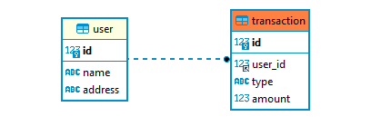 
 
<em>ER Diagram of Database</em>

In user table, the column consist of id which will be the primary key of user table, then there is the name, and address column. User table data type includes:

- id : BIGINT as primary key. I use BIGINT rather than INT because BIGINT can hold more numbers than INT. This is why BIGINT is very suitable to be applied to user table that can later have many users.
- name: VARCHAR(255).
- address: VARCHAR(255)

In transaction table, there is also id as primary key of the table, then user_id which will be as foreign key. Transaction table data type includes:

- id : BIGINT as primary key.
- user_id : BIGINT as foreign key.
- type : ENUM consist of **income** and **expense**.
- amount : DOUBLE, to store large values of decimal numbers.

More or less, this is the contents of the user and transaction table:

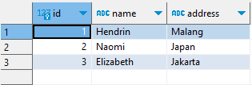 
 
<em>User Table Content</em>

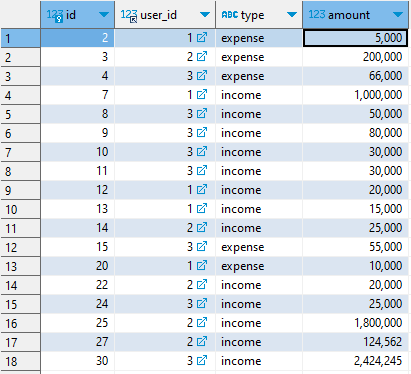 
 
<em>Transaction Table Content</em>

# API endpoints

Here are the API endpoints that i used for this project:

- **GET /users** : GET all user list.
- **GET /user/:id** : GET user by use user ID.
- **POST /transaction** : Create expense/income transaction.
- **PUT /transaction/:id** : Update transaction.
- **DELETE /transaction/:id** : Delete transaction.

# Deploy the Project with fly.io

Deploying this project with fly.io is tricky ones,
because fly.io does not have sufficiently detailed documentation in deploying a MySQL project. But here, i will try to make it simple as posible.

1. Make a new directory for MySQL app.
2. With powershell, go to the directory that was created earlier.
   

   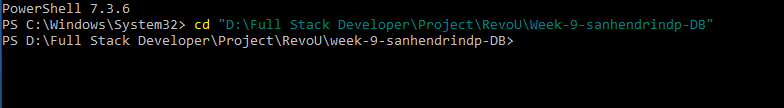
   

3. Run **fly launch** to create MySQL app. After that, we need to give our app a name, then choose a region.
    

   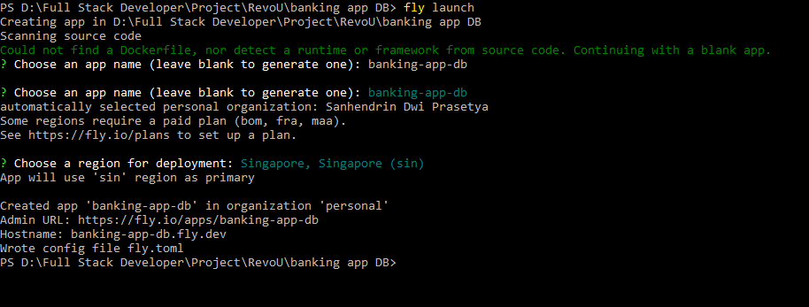
   

4. Configure the app by create a volume named mysqldata.
    

   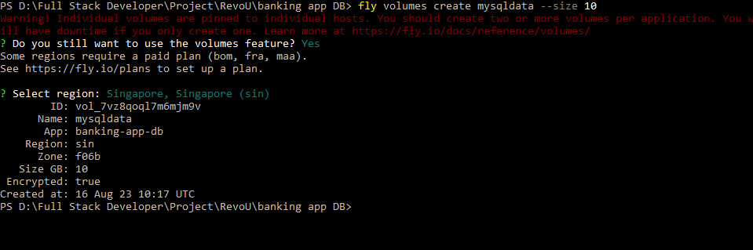
   

5. Set some secrets for MySQL container. Here, i set the password & root password as 1234.
    

   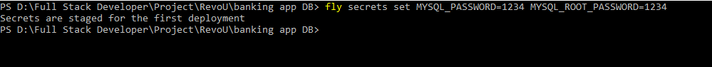
   

6. Edit the fly.toml file that fly launch generated. Open that file with VS Code and edit it like this:
    

   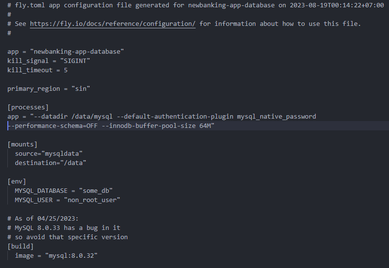
   

7. Now we can deploy the MySQL app with command **fly deploy**.
8. After MySQL app deploying is success, use command **flyctl ips private** so we know our MySQL app IP address, then copy that IP address to our Node JS project.
    

   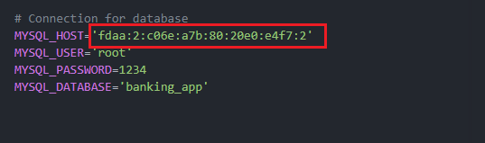
   

9. Finally, deploy our Node JS project! Go to the directory where the Node JS project created. Then as usual use command **fly launch** and **fly deploy**, to deploying our Node JS app.
    

   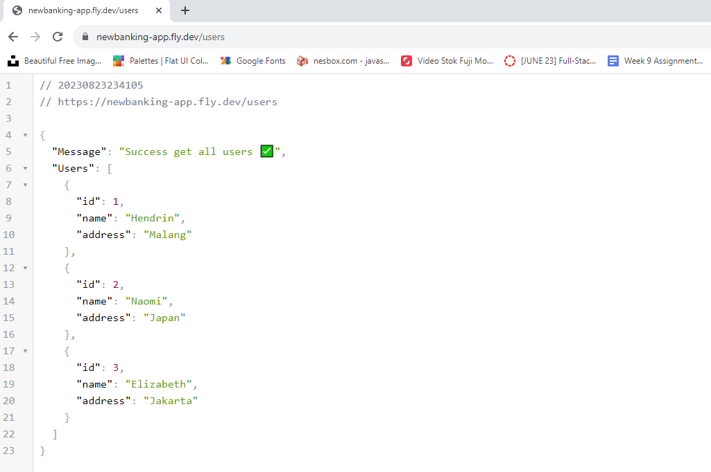
    
   <em>Deployment Success</em>
   

10. To remote our database production in local, in powershell, don't forget to change the directory where our MySQL app was created before, then run the command **flyctl proxy** with custom port and the name of our MySQL app.
    

    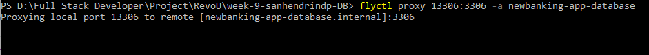
    

---

Thank you 🙏

